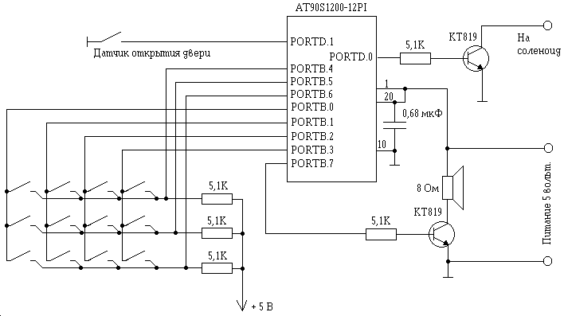

# Электронный кодовый замок
## Назначение и описание устройства
Схема предназначена для работы в качестве электронного кодового замка, музыкального звонка и устройства регистрации. Секретный код состоит из 5 десятичных цифр и набирается на 11 кнопочной клавиатуре, дополнительная кнопка используется как сброс в случае если была нажата неверная клавиша. Предусмотрена возможность ввода нового кода с этой же клавиатуры. При нажатии на кнопку звонка микроконтроллер проигрывает мелодию, или выдает звуковой сигнал напоминающий звонок телефонного аппарата. Первый вариант выбирается в случае если первая цифра секретного кода четная, а второй если нечетная. При проигрывании мелодии останавливается вывод данных во внешний компьютер, поэтому если шел прием данных и был нажат звонок, потребуется дополнительное время на исправление возникшей ошибки. При проигрывании простого сигнала такого не происходит. Кроме того для правильного воспроизведения мелодии желательно использовать внешний кварц вместо внутреннего RC генератора микросхемы. Вы можете прослушать звукозапись проигрываемой мелодии нажав на эту ссылку: [40 кБ mp3](lock.mp3). Микроконтроллер имеет 64 байта энергонезависимой памяти (EEPROM), которая используется для записи происходящих событий. Есть 3 типа событий: включение питания, правильный набор кода и неправильный набор кода. Одновременно с событием записывается время прошедшее после предыдущей записи. Точность записи времени около 8 минут. Если время между записями превысило 50 суток, дальнейший счет времени останавливается. Естественно что для точного счета времени надо использовать кварцевый, а не встроенный RC генератор.

Содержимое энергонезависимой памяти постоянно побитно, с частотой 3.815 Гц выводится на один из выводов микроконтроллера и может быть считано для контроля внешним компьютером. Объем памяти позволяет хранить 30 записей по 2 байта. Число циклов записи в EEPROM ограничено, поэтому для увеличения срока службы используется специальный формат записи, разобраться в нем можно по исходному коду программы. Программу для чтения информацию из EEPROM я не написал.

После включения питания секретный код равен числу 23232. Для его изменения надо:
1. набрать старый код, при этом сработает соленоид открывающий замок;
2. в момент отключения соленоида должна быть нажата кнопка 2, это переведет устройство в режим ввода нового пароля;
3. ввести новый пароль, при ошибке можно пользоваться клавишей сброса.
Измененный код не сохраняется в EEPROM в целях безопасности (EEPROM может быть стерта), но его можно изменить в исходнике перед прошивкой микроконтроллера.

Все нажатия на клавиши и некоторые другие действия озвучиваются короткими звуковыми сигналами.

## Схема и программа

Питание на микроконтроллер подается постоянно, поэтому желательно использовать сетевой блок питания, а не батарейки.

В качестве исполнительного устройства проще всего использовать подходящий электромагнит. Но можно и электродвигатель, тогда надо добавить небольшую схему на основе выключателей, которая должна обеспечивать открытие замка при единице на соответствующем выводе микроконтроллера и закрытие при нуле.

Статья об этом устройстве опубликована в в журнале [Радиолюбитель](http://radioliga.com) и книге М.Голубцова "Микроконтроллеры AVR от простого к сложному"
